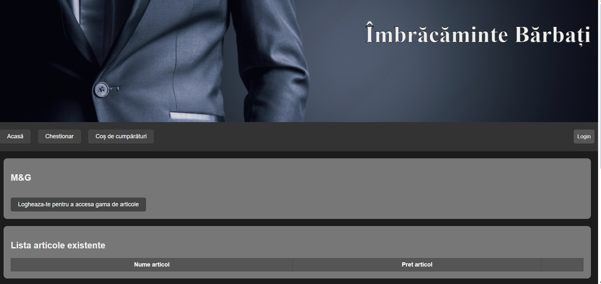
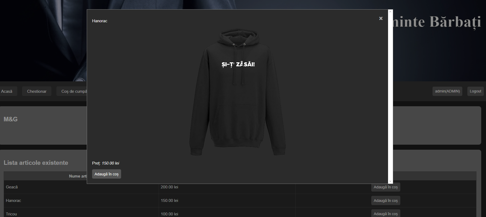

# MenClothesWebsite-usingNodeJS

This project is a men's clothing website developed using Node.js, HTML, and CSS. The website features a questionnaire for users, an authentication system, and a shopping cart functionality.

# Website Overview



## Set-up

1. Clone the repository:
    ```sh
    git clone https://github.com/Drexel7/MenClothesWebsite-usingNodeJS.git
    ```
2. Navigate to the project directory:
    ```sh
    cd MenClothesWebsite-usingNodeJS
    ```
3. Install the necessary dependencies:
- [Node.js](https://nodejs.org/en/download/package-manager)
- [npm](https://docs.npmjs.com/downloading-and-installing-node-js-and-npm)

4. Start the server:
    ```sh
    node app.js
    ```
5. Open your web browser and navigate to:
    ```
    http://localhost:6789
    ```

# Shopping Page



